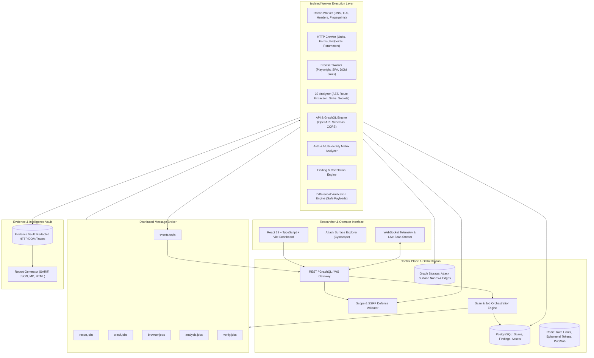
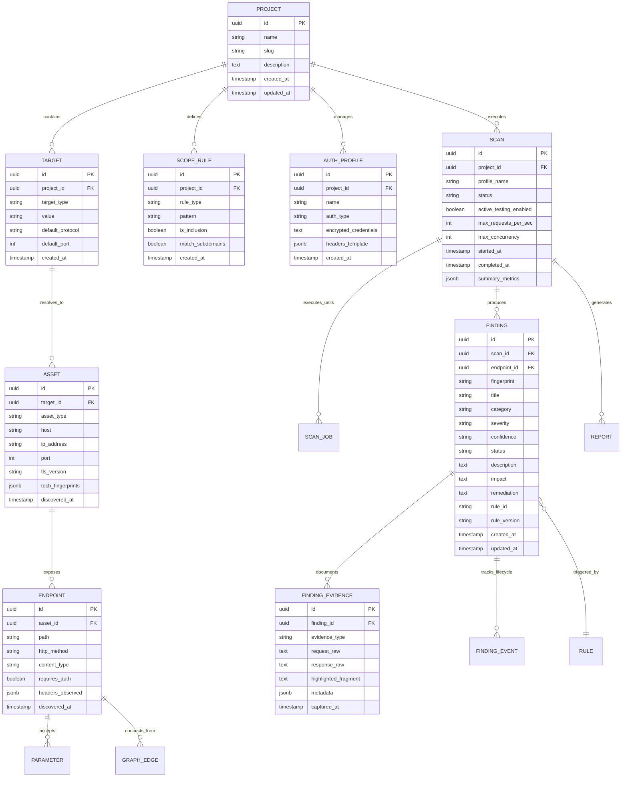
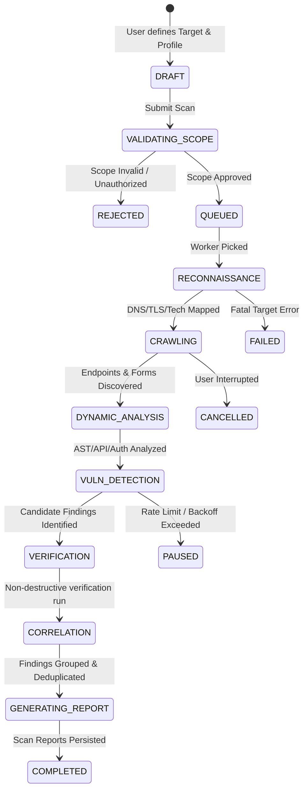

# DontTrust: System Architecture & Technical Design Specification

## Advanced Web Application Security Assessment & Attack-Surface Intelligence Platform

---

## 0. Implementation Boundary

The current public repository provides a local, single-host reference implementation optimized for reproducible development, testing, and benchmarking with an in-memory job broker and file-backed graph storage (`packages/storage`, `packages/scanner-sdk`).

The distributed deployment architecture described below represents the target production design for horizontally scalable worker swarms, RabbitMQ message brokers, PostgreSQL persistent storage, Redis caching, and Prometheus/Grafana observability.

---

## 1. System Architecture

DontTrust is architected as an asynchronous, event-driven, distributed intelligence and security assessment platform. The architecture cleanly separates:
1. **Control Plane**: Manages project metadata, authorization, target scope policies, scan lifecycles, and configuration.
2. **Message Broker / Event Bus**: Coordinates decoupled workers across distinct scanning and analysis phases.
3. **Distributed Worker Swarm**: Stateless workers executing network recon, deterministic HTTP crawling, headless browser instrumentation, static JavaScript parsing/AST analysis, API analysis, active injection detection, and non-destructive verification.
4. **Attack-Surface Knowledge Graph**: Correlates domains, endpoints, parameters, forms, scripts, technologies, and auth contexts.
5. **Finding & Evidence Vault**: Decoupled severity vs. confidence scoring engine, non-destructive verification pipeline, deduplication, and cryptographically structured raw HTTP/DOM evidence storage with automated secret redaction.
6. **Presentation & Intelligence UI**: Information-dense, dark-theme security researcher dashboard with real-time WebSocket telemetry, interactive graph exploration (Cytoscape/D3), and multi-format report exports (SARIF, JSON, Markdown, HTML).



---

## 2. Repository Structure

A monorepo structure designed for modularity, strict package isolation, clean testing boundaries, and multi-language worker extensibility:

```text
donttrust/
├── apps/
│   ├── web/                        # React + TypeScript + Vite + Tailwind Security Dashboard
│   └── api/                        # Control Plane API & Central Scan Orchestrator
├── services/
│   ├── recon-worker/               # DNS, TLS, Header & Tech Fingerprint Service
│   ├── crawler-worker/             # Deterministic HTTP Crawler & Form Parser
│   ├── browser-worker/             # Playwright-driven Dynamic SPA & DOM Sink Crawler
│   ├── js-analyzer/                # AST Parser, Route Extractor, Secret & Sink Detector
│   ├── api-analyzer/               # REST, OpenAPI, GraphQL & WebSocket Protocol Inspector
│   ├── auth-analyzer/              # Multi-Identity Matrix & State-Transition Analyzer
│   ├── finding-engine/             # Rule Evaluation, Correlation, & Deduplication
│   ├── verification-engine/        # Non-destructive Differential Verification Engine
│   └── report-engine/              # SARIF 2.1.0, JSON, Markdown, HTML Exporter
├── packages/
│   ├── scanner-sdk/                # Base types, worker harnesses, and telemetry hooks
│   ├── finding-schema/             # Universal finding schemas, severity/confidence models
│   ├── scope-engine/               # RFC 3986 URL parser, CIDR, Regex & SSRF guardrails
│   ├── protocol-models/            # HTTP Request/Response, AST node, & DOM event definitions
│   └── common/                     # Cryptographic hashing, redaction, and logging utilities
├── rules/
│   ├── http/                       # Verb tampering, header misconfigurations, MIME bypass
│   ├── headers/                    # CSP, HSTS, X-Frame-Options, Permissions-Policy
│   ├── cookies/                    # Secure, HttpOnly, SameSite, Prefix validations
│   ├── tls/                        # Cipher strength, cert expiry, SAN match, revocation
│   ├── cors/                       # Origin reflection, null origin, credentialed wildcards
│   ├── auth/                       # Session fixation, token leaks, missing re-auth
│   ├── authorization/              # IDOR, horizontal/vertical privilege matrix tests
│   ├── api/                        # Mass assignment, unhandled verbs, schema anomalies
│   ├── graphql/                    # Introspection, depth limits, batching attacks
│   ├── websocket/                  # CSWSH, missing origin validation, unauthenticated frame
│   ├── javascript/                 # Source maps, dangerouslySetInnerHTML, eval/Function sinks
│   ├── configuration/              # .env, .git, debug endpoints, stack traces, directory listing
│   ├── information-disclosure/     # Internal IPs, private keys, cloud tokens, verbose SQL errors
│   └── technology/                 # CVE / Advisory mappings & fingerprint signatures
├── lab/
│   ├── vulnerable-app/             # Local Dockerized multi-vulnerability lab target
│   └── mock-services/              # Mock DNS, TLS, and OOB listener mocks for regression testing
├── infrastructure/
│   ├── docker/                     # Dockerfiles & Multi-stage container configs
│   ├── docker-compose.yml          # Complete standalone local dev stack
│   ├── kubernetes/                 # K8s manifests for distributed worker scaling
│   ├── prometheus/                 # Metrics scraper configurations
│   └── grafana/                    # Operational & Scan Telemetry Dashboards
├── docs/                           # Architecture, Threat Model, Rules, and API documentation
└── tests/                          # Integration, Negative-test & Rule benchmark suites
```

---

## 3. Database ER Diagram

The database schema utilizes relational constraints (PostgreSQL) paired with JSONB for flexible payload/evidence metadata and graph-like adjacency representation:



---

## 4. Core Domain Model

1. **Project & Workspace**: Logical isolation container for all targets, findings, scopes, and user permissions.
2. **Target**: Authorized hostname, domain, URL, or IP address range.
3. **ScopePolicy**: Immutable, high-speed compiled rule set evaluating whether a candidate URI is `ALLOWED`, `EXCLUDED`, or `OUT_OF_BOUNDS`.
4. **ScanSession**: State machine tracking the overall lifecycle, configuration, telemetry, rate budget, and status of an assessment run.
5. **AttackSurfaceNode & Edge**: Abstract entity representing pages, scripts, forms, parameters, endpoints, web-sockets, and their functional couplings.
6. **Finding**: Formal observation with distinct `Severity` (CRITICAL, HIGH, MEDIUM, LOW, INFO) and `Confidence` (CONFIRMED, HIGH, MEDIUM, LOW, TENTATIVE).
7. **EvidenceRecord**: Immutable, cryptographically verified record containing full request/response pairs, redacted secrets, timing metrics, and reproduction instructions.

---

## 5. Queue & Message Architecture

RabbitMQ provides message exchange routing with Dead Letter Exchanges (DLX), priority queues, and backpressure:

```text
Exchanges:
├── donttrust.scan.direct     -> Direct exchange for targeted worker tasks
├── donttrust.events.topic    -> Topic exchange for telemetry, status, discoveries
└── donttrust.dlx.direct      -> Dead-letter routing for exhausted retries

Queues:
├── q.recon.tasks         [recon.worker]       (Priority: Normal)
├── q.crawl.tasks         [crawler.worker]     (Priority: Normal)
├── q.browser.tasks       [browser.worker]     (Priority: Low/Standard)
├── q.analysis.tasks      [analyzer.workers]   (Priority: High)
├── q.verification.tasks  [verify.worker]      (Priority: Urgent)
├── q.report.tasks        [report.worker]      (Priority: Low)
└── q.scan.events         [api.websocket]      (Real-time event pipe)
```

**Job Envelope Standard:**
```json
{
  "job_id": "9b1deb4d-3b7d-4bad-9bdd-2b0d7b3dcb6d",
  "scan_id": "c71a39f4-8a4b-4a55-bb90-7cb529b3ce21",
  "project_id": "a4d3f110-3490-449e-b9ff-2940bc2bce41",
  "phase": "CRAWL_HTTP",
  "target": {
    "url": "https://app.target.local/api/v1/users",
    "method": "GET",
    "auth_context": "ANONYMOUS"
  },
  "scope_hash": "sha256:7f83b1657ff1fc53b92dc18148a1d65dfc2d4b1fa3d677284addd200126d9069",
  "limits": {
    "max_depth": 3,
    "timeout_ms": 10000,
    "rate_limit_per_sec": 10
  },
  "attempt": 1,
  "max_attempts": 3,
  "created_at": "2026-10-02T22:30:00Z",
  "deadline": "2026-10-02T22:35:00Z"
}
```

---

## 6. Worker Architecture

Each worker is a lightweight, stateless micro-service implementing standard lifecycle hooks:
* **Pre-Execution Guard**: Verifies job target against compiled `ScopeEngine` before opening any socket.
* **Rate-Limiting Token Bucket**: Consults central Redis token bucket / local leaky bucket before emitting requests.
* **Safety Sandbox**: Enforces request timeout, maximum response byte ceiling (5MB default to prevent memory exhaustion), and HTTP decompression guards.
* **Discovery Emitter**: Pushes new nodes, links, and forms back to the discovery router.
* **Failure Classifier**: Classifies network timeouts vs. HTTP 429 backoff vs. fatal connection drops.

---

## 7. Scope Engine & SSRF Defense Model

The `ScopeEngine` is the single source of truth for request authorization:
1. **URI Decomposition**: Scheme, host, port, path, query parameters.
2. **Protocol Allowlist**: `http`, `https` (strictly blocks `file://`, `gopher://`, `dict://`, `ftp://`).
3. **Private IP & Loopback Blacklist (SSRF Protection)**:
   - `127.0.0.0/8`, `::1/128` (Loopback)
   - `10.0.0.0/8`, `172.16.0.0/12`, `192.168.0.0/16` (RFC 1918)
   - `169.254.0.0/16`, `fe80::/10` (Link-Local & Cloud Metadata e.g. AWS 169.254.169.254)
   - `0.0.0.0/8`, `100.64.0.0/10`, `198.18.0.0/15`
   - Configurable override for controlled lab targets on private subnets.
4. **Domain Wildcard Matching**: `*.example.com` matches `api.example.com` but not `evil-example.com` or `example.com.attacker.com`.
5. **Path Blacklist/Whitelist**: Regex-based exclusion (e.g. `/logout`, `/admin/delete`).
6. **Redirect Guard**: Every redirect response triggers re-validation before following.

---

## 8. Scan Lifecycle State Machine



---

## 9. Finding Lifecycle & Confidence Model

```text
Status Transitions:
[CANDIDATE] ──(Automated Differential Test Passes)──> [VERIFIED]
     │                                                     │
     │ (Strong Passive Evidence / Signatures)              │ (Manual or Strict Confirmation)
     ▼                                                     ▼
  [OPEN] ───────────────────────────────────────────> [CONFIRMED]
     │                                                     │
     ├──(Marked as Expected / Verified Safe)────────> [FALSE_POSITIVE]
     ├──(Accepted by SecOps Risk Policy)───────────> [ACCEPTED_RISK]
     └──(Fix Validated in Regression Scan)─────────> [RESOLVED]
```

**Severity vs. Confidence Matrix:**
* **Severity**: `CRITICAL` (RCE, Auth Bypass), `HIGH` (SQLi, IDOR, SSRF, Stored XSS), `MEDIUM` (CORS Misconfig, CSRF, Reflected XSS), `LOW` (Missing Security Headers, Cookie Flags), `INFO` (Tech Stack Disclosure).
* **Confidence**: `CONFIRMED` (Differential payload execution confirmed), `HIGH` (Exact pattern + DOM/Response evidence), `MEDIUM` (Structural indicator without execution proof), `LOW` (Version banner or weak behavioral clue), `TENTATIVE` (Observation requiring manual investigation).

---

## 10. Attack-Surface Graph Model

Nodes:
* `DomainNode` (`name`, `ip`, `whois`)
* `TlsCertificateNode` (`issuer`, `valid_to`, `san_entries`)
* `ServiceNode` (`port`, `protocol`, `banner`)
* `EndpointNode` (`path`, `method`, `status_code`, `content_type`)
* `ParameterNode` (`name`, `in: query|body|header|path`, `inferred_type`)
* `FormNode` (`action`, `method`, `inputs`)
* `ScriptAssetNode` (`url`, `hash`, `ast_endpoints_count`)
* `ApiSchemaNode` (`type: openapi|graphql|grpc`, `version`)
* `FindingNode` (`severity`, `rule_id`, `status`)

Edges:
* `RESOLVES_TO` (`Domain` -> `Service`)
* `SECURED_BY` (`Service` -> `TlsCertificate`)
* `EXPOSES` (`Service` -> `Endpoint`)
* `ACCEPTS` (`Endpoint` -> `Parameter`)
* `EMBEDS` (`Endpoint` -> `Form`)
* `LOADS` (`Endpoint` -> `ScriptAsset`)
* `CALLS` (`ScriptAsset` -> `Endpoint`)
* `AFFECTS` (`Finding` -> `Endpoint`)

---

## 11. Security Threat Model (for DontTrust itself)

| Threat | Description | Mitigation in DontTrust |
|---|---|---|
| **SSRF via Control Plane** | Attacker supplies target URLs pointing to internal AWS metadata (`169.254.169.254`) or localhost. | Strict `ScopeEngine` IP resolution validation, blocking non-routable/loopback/link-local addresses prior to network calls, re-validating on redirects. |
| **Malicious Target Payload Injection (XSS)** | Hostile scanned target embeds malicious script tags in page title, headers, or body to attack scanner UI. | Output sanitization, strict React JSX escaping, no `dangerouslySetInnerHTML`, Content-Security-Policy on UI. |
| **Worker Remote Code Execution (RCE)** | Target returns malicious compressed payload (Zip/Gzip Bomb) or exploits AST/HTML parsers. | Maximum response size caps (5MB), recursion depth limits on AST walkers, isolated container runtimes. |
| **Browser Worker Escape** | Target attempts Chromium sandbox escape or file system theft. | Headless Playwright run in non-root sandboxed container, `--disable-gpu`, `--disable-dev-shm-usage`, blocking `file://` protocol. |
| **Secret Leakage in Evidence & Logs** | Scanned target reflects authentication credentials, API keys, or JWT tokens in HTTP dumps. | Central automated Secret Redaction filter (`[REDACTED_API_KEY]`, `Bearer **********`) applied before persistence. |

---

## 12. API Specification (REST & WebSocket)

### Core Endpoints:
* `POST /api/v1/projects`: Create a project.
* `GET  /api/v1/projects/{id}`: Fetch project details, targets, scopes.
* `POST /api/v1/projects/{id}/targets`: Add target URL/domain with validation.
* `POST /api/v1/projects/{id}/scopes`: Configure inclusion/exclusion rules.
* `POST /api/v1/scans`: Launch scan with specified `profile` and `active_testing` flag.
* `GET  /api/v1/scans/{id}`: Real-time scan telemetry, current stage, worker health.
* `POST /api/v1/scans/{id}/cancel`: Graceful abort.
* `GET  /api/v1/scans/{id}/attack-surface`: Graph payload (nodes & edges for Cytoscape).
* `GET  /api/v1/scans/{id}/findings`: Filterable findings list (`severity`, `confidence`, `status`).
* `GET  /api/v1/findings/{id}`: Detailed finding record, reproduction steps, raw evidence.
* `POST /api/v1/findings/{id}/verify`: Trigger targeted on-demand differential verification.
* `GET  /api/v1/reports/{scan_id}?format=sarif|json|markdown|html`: Download reports.
* `WS   /ws/scans/{id}/live`: Real-time streaming WebSocket event feed.

---

## 13. Frontend Information Architecture

* **Dashboard Header**: Global Project Selector, System Health Badge, Active Scan Indicator, Global Quick-Search (`Ctrl+K`).
* **Main Navigation**:
  1. `Projects & Targets`: Management of authorized assets & scope boundaries.
  2. `Scans & Jobs`: Scan launcher, active pipeline viewer, execution history.
  3. `Attack Surface Explorer`: Interactive graph visualization with node inspectors.
  4. `Endpoints & Assets`: High-density tabular view of discovered URLs, APIs, scripts.
  5. `Findings & Evidence`: Filterable vulnerability inventory with dual severity/confidence badges.
  6. `Identity & Auth Matrix`: Multi-role privilege matrix comparison view.
  7. `Reports & Export`: SARIF, Markdown, JSON, HTML report builders.
  8. `Settings & Audit Log`: System configs, worker pool telemetry, rate-limiting presets.

---

## 14. Testing Strategy

1. **Unit Tests**:
   - `scope-engine`: Comprehensive IP range, wildcard domain, path regex, and SSRF rejection tests.
   - `finding-schema`: Validation of severity/confidence constraints and serialization.
   - `rules`: Rule unit tests with mock HTTP request/response fixtures.
2. **Integration Tests**:
   - API endpoints, scan state transitions, and worker queue publishers.
3. **Security Lab Regression Tests**:
   - Controlled vulnerable test target (`lab/vulnerable-app`) running locally.
   - Positive test: Verify detection of Reflected XSS, CORS Misconfig, Insecure Headers, Directory Traversal.
   - Negative test: Verify 0 false positives against secure baseline test routes.
4. **Performance & Concurrency Tests**:
   - High-throughput crawler rate limiting and memory stability checks under 100+ concurrent requests.

---

## 15. Development Milestones

* **Milestone 1: Repository Architecture, Core Contracts & Monorepo Foundation** (THIS MILESTONE)
  - Monorepo structure, build configuration, shared TypeScript/JSON packages (`finding-schema`, `scope-engine`, `protocol-models`, `common`).
  - Strict Scope Engine implementation with unit tests and SSRF guardrails.
  - Core domain models, interfaces, and rule SDK contracts.
* **Milestone 2: Control Plane API & Central Scan Orchestrator**
  - High-performance API server, SQLite/PostgreSQL storage, scan state machine, WebSocket event hub.
* **Milestone 3: Reconnaissance & HTTP Crawling Engine**
  - DNS, TLS, Header analyzer, deterministic HTTP crawler, form parser, technology fingerprinting.
* **Milestone 4: Dynamic Browser Crawler & JavaScript Static Analysis Engine**
  - Playwright browser worker for SPAs, AST route extractor, DOM source/sink analyzer, secret detection.
* **Milestone 5: Attack Surface Knowledge Graph & API/Auth Analysis**
  - Graph database storage, multi-identity authorization matrix analyzer, GraphQL & REST inspector.
* **Milestone 6: Vulnerability Rules, Differential Verification & Finding Engine**
  - Comprehensive rule library (Injection, XSS, CORS, Headers, Config, Auth, Info Disclosure), differential verifier, evidence vault.
* **Milestone 7: Professional Security Researcher UI & Attack Surface Visualizer**
  - React 19 + TypeScript dashboard, Cytoscape graph visualizer, Live scan timeline, Finding detail & evidence viewer.
* **Milestone 8: Security Lab, Reporting (SARIF/HTML/MD) & End-to-End Regression Suite**
  - Dockerized test lab, SARIF 2.1.0 engine, positive/negative benchmark suite, CLI tool.
