# AegisScan: Current System State & Architectural Audit

**Audit Date:** October 2, 2026  
**Codebase Version:** 1.0.0-PRO (Initial Foundation)  
**Verification Baseline:** 10 Test Suites, 33 Passing Tests, Clean Monorepo Build  

---

## 1. Executive Summary

This document provides a realistic, evidence-based technical audit of the current AegisScan repository. It distinguishes between what is **production-functional**, what is **partially implemented or in-process**, what is **simulated/monolithic**, and what remains **missing** to achieve the vision of a research-grade, distributed attack-surface intelligence and assessment platform.

---

## 2. Detailed Implementation Inventory

### 2.1 Fully Implemented & Working in Production

| Component | Location | Implementation Details & Proof |
|---|---|---|
| **Scope & SSRF Engine** | [`packages/scope-engine`](file:///c:/Users/mrabh/OneDrive/Desktop/bullu/packages/scope-engine/src) | Complete RFC 3986 parser, domain wildcard matcher (`*.domain.com`), path exclusion globbing (`/logout`, `/admin/delete*`), protocol whitelist (`http:`, `https:` only), and bitwise IP validation blocking Loopback, RFC 1918 Private ranges, Carrier-Grade NAT, and Cloud Metadata (`169.254.169.254`). Verified by 12 passing unit tests. |
| **Finding Taxonomy & Builder** | [`packages/finding-schema`](file:///c:/Users/mrabh/OneDrive/Desktop/bullu/packages/finding-schema/src) | Strict dual classification of **Severity** (`CRITICAL`, `HIGH`, `MEDIUM`, `LOW`, `INFO`) and **Confidence** (`CONFIRMED`, `HIGH`, `MEDIUM`, `LOW`, `TENTATIVE`). Schema validation and mandatory reproduction/evidence fields. Verified by unit tests. |
| **Evidence Redactor & Hasher** | [`packages/common`](file:///c:/Users/mrabh/OneDrive/Desktop/bullu/packages/common/src) | Automated credential scrubbing (`Authorization: Bearer`, session cookies, AWS keys, RSA/EC PEM keys) and SHA-256 deterministic finding fingerprinting. Verified by 4 passing unit tests. |
| **Rate Limiter** | [`packages/scanner-sdk`](file:///c:/Users/mrabh/OneDrive/Desktop/bullu/packages/scanner-sdk/src) | Leaky/Token Bucket rate controller with concurrency semaphore. Verified by unit tests. |
| **Security Rule Catalog** | [`rules/`](file:///c:/Users/mrabh/OneDrive/Desktop/bullu/rules/src) | 7 Modular detection rules (Headers, Insecure Cookies, CORS Origin Reflection + Canary Verifier, SQL Injection Syntax Disclosure + Verifier, Reflected XSS + Benign Canary Verifier, Exposed .git/.env config, and Exposed Secrets). Verified by unit tests. |
| **Control Plane REST & WS API** | [`apps/api`](file:///c:/Users/mrabh/OneDrive/Desktop/bullu/apps/api/src) | Complete Express REST API + WebSocket server streaming live scan telemetry, graph queries, findings filters, and multi-format report exports (SARIF 2.1.0, Markdown, JSON, HTML). Verified by 5 integration tests. |
| **Security Researcher UI** | [`apps/web`](file:///c:/Users/mrabh/OneDrive/Desktop/bullu/apps/web/src) | React 19 + TypeScript + Vite + Tailwind CSS dashboard featuring Live Scan Timeline, Attack Surface Graph Explorer, Endpoints & APIs view, Findings & Evidence Vault with cURL copier, Rule catalog, and Report exporter. Production bundle builds with 0 errors. |
| **CLI Tool** | [`apps/cli`](file:///c:/Users/mrabh/OneDrive/Desktop/bullu/apps/cli/src) | Command-line tool supporting `scope:check`, `redact`, and `scan:start`. Verified by 2 unit tests. |
| **Local Security Lab Target** | [`lab/vulnerable-app`](file:///c:/Users/mrabh/OneDrive/Desktop/bullu/lab/vulnerable-app/src) | Express target with positive vulnerable routes (XSS, SQL syntax error, CORS reflection, cookie flags, .env, .git) and negative hardened route (`/safe-endpoint`). |
| **E2E Benchmark Suite** | [`tests/e2e`](file:///c:/Users/mrabh/OneDrive/Desktop/bullu/tests/e2e) | Automated test verifying that the scanner discovers true positives on the lab app while preserving fingerprint integrity. |

---

### 2.2 Partially Implemented (Requires Deepening)

1. **Scan Orchestrator (`apps/api/src/orchestrator.ts`)**:
   - *Current State:* Runs all scan phases (Recon, Crawl, Detection, Verification, Report) sequentially within a single Node.js async function.
   - *Limitation:* Not distributed; workers do not run as decoupled processes or communicate via message queues.
2. **State Store (`apps/api/src/store.ts`)**:
   - *Current State:* Uses in-memory TypeScript `Map` instances (`projects`, `targets`, `scans`, `findings`, `graphs`).
   - *Limitation:* State is lost on server restart; lacks PostgreSQL persistence and Redis distributed caching/locks.
3. **Attack-Surface Graph Representation**:
   - *Current State:* Generates nodes (`DOMAIN`, `PORT`, `ENDPOINT`, `FINDING`) and edges (`RESOLVES_TO`, `EXPOSES`, `AFFECTS`) in memory.
   - *Limitation:* The scanner does not yet execute graph-traversal queries to discover transitive vulnerabilities or multi-hop data-flows.
4. **Technology Fingerprinting**:
   - *Current State:* Extracts basic `Server` and `X-Powered-By` response headers.
   - *Limitation:* Lacks multi-signal DOM, JavaScript bundle, and hash-based technology fingerprinting.

---

### 2.3 Simulated or Mocked in Current Version

1. **Dynamic Browser Crawling**:
   - *Current State:* The crawler uses deterministic HTTP `fetch()` with seed endpoint expansion.
   - *Simulated Aspect:* Full headless Chromium / Playwright DOM event instrumentation (capturing runtime XHR/fetch/DOM mutations) is represented in architecture models but not yet executing dedicated worker containers.
2. **JavaScript AST Data-Flow Analysis**:
   - *Current State:* JavaScript analysis uses regex-based secret scanning in HTTP responses.
   - *Simulated Aspect:* Full Babel/Acorn AST parsing for source-to-sink taint tracking is specified in domain models but not yet implemented as an isolated worker service.
3. **Multi-Identity Authorization Matrix**:
   - *Current State:* Data types and auth profiles (`AuthProfile`, `AuthorizationMatrixEntry`) are defined in `@aegisscan/protocol-models`.
   - *Simulated Aspect:* Automated cross-identity differential probing (Anonymous vs. User A vs. User B vs. Admin) is not yet executing active comparison passes.

---

### 2.4 Currently Missing

1. **Distributed Message Broker (RabbitMQ)**: Dedicated message queues (`aegis.recon`, `aegis.crawl`, `aegis.browser`, `aegis.analysis`, `aegis.verification`, `aegis.report`) with dead-letter exchanges and worker acknowledgment.
2. **Decoupled Worker Services**: Independent worker processes in `services/` (`recon-worker`, `crawler-worker`, `browser-worker`, `js-analyzer`, `api-analyzer`, `auth-analyzer`, `verification-worker`, `report-worker`).
3. **PostgreSQL Migrations & Schema**: Persistent relational tables for scans, findings, evidence blobs, assets, and historical baselines.
4. **Redis Coordination**: Distributed rate-limiting token buckets and scan lock management.
5. **Differential Response Engine**: Central normalization of dynamic noise (timestamps, nonces, session IDs, request IDs) for structural response diffing.
6. **Security Regression & Baseline Comparison Engine**: Automated diffing between Scan $N$ and Scan $N+1$ (`NEW`, `RESOLVED`, `CHANGED`, `UNCHANGED`).
7. **OpenAPI / GraphQL Introspection Parser**: Dynamic schema learning and parameter model generator.

---

## 3. Top 10 High-Impact Architectural Gaps

1. **Monolithic In-Process Orchestrator:** Scan lifecycle executed in single process rather than across message-driven worker swarm.
2. **In-Memory Volatile Storage:** State stored in ephemeral memory Maps instead of PostgreSQL with ACID guarantees and migrations.
3. **Absence of Headless Browser Execution:** Dynamic single-page applications (SPAs) requiring DOM execution cannot be fully crawled without Playwright workers.
4. **Static AST Analysis Void:** Client-side JavaScript is not parsed into an Abstract Syntax Tree to trace sources (`location.search`, `postMessage`) to sinks (`eval`, `innerHTML`).
5. **Lack of Automated Multi-Role Privilege Matrix:** Authorization differential testing across multiple configured roles is not automated.
6. **Absence of Centralized Differential Engine:** Noise-normalized response comparison is handled ad-hoc rather than by a dedicated engine.
7. **Graph as Visualizer Rather Than Intelligence Engine:** Graph does not yet drive scanner reasoning and prioritized scanning.
8. **No Persistent Baseline / Regression Engine:** Cannot compute diffs against historical baseline scans to detect security regressions in CI/CD.
9. **Single-Point Rate Limiting:** Rate limiter is local to the process rather than coordinated across distributed workers via Redis.
10. **Lack of OpenTelemetry / Prometheus Metrics Exporter:** Metrics are stored only in memory scan objects rather than exported for operational observability.

---

## 4. Components to Preserve (Do Not Rewrite)

* **[`packages/scope-engine`](file:///c:/Users/mrabh/OneDrive/Desktop/bullu/packages/scope-engine)**: Exceptionally solid SSRF defense, CIDR matching, and wildcard domain logic.
* **[`packages/finding-schema`](file:///c:/Users/mrabh/OneDrive/Desktop/bullu/packages/finding-schema)**: Clean, decoupled Severity vs. Confidence taxonomy and finding builder.
* **[`packages/common`](file:///c:/Users/mrabh/OneDrive/Desktop/bullu/packages/common)**: Reliable secret redactor, stable fingerprint hasher, and structured logger.
* **[`packages/protocol-models`](file:///c:/Users/mrabh/OneDrive/Desktop/bullu/packages/protocol-models)**: Universal interfaces for HTTP, Graph, Cookies, Forms, and Auth profiles.
* **[`packages/scanner-sdk`](file:///c:/Users/mrabh/OneDrive/Desktop/bullu/packages/scanner-sdk)**: Standard `SecurityRule` base class and token-bucket algorithm.
* **[`rules/`](file:///c:/Users/mrabh/OneDrive/Desktop/bullu/rules)**: Modular rule catalog and active canary verification routines.
* **[`apps/web`](file:///c:/Users/mrabh/OneDrive/Desktop/bullu/apps/web)**: Professional, restrained dark engineering UI.

---

## 5. Recommended Evolution Sequence (Milestones 1 to 24)

```mermaid
flowchart TD
    M1["M1: Audit & Documentation (COMPLETED)"] --> M2["M2: Persistent Database & Relational Migrations"]
    M2 --> M3["M3: Real Scan State Machine & Session Lifecycle"]
    M3 --> M4["M4: Message Broker & Distributed Job Envelopes"]
    M4 --> M5["M5: Decoupled Worker Swarm Architecture"]
    M5 --> M6["M6: Reconnaissance Engine (DNS, TLS, Banners)"]
    M6 --> M7["M7: Advanced HTTP Crawler & Form Parser"]
    M7 --> M8["M8: Headless Browser Worker (Playwright SPAs)"]
    M8 --> M9["M9: Attack Surface Knowledge Graph Engine"]
    M9 --> M10["M10: API & GraphQL Intelligence Engine"]
    M10 --> M11["M11: JavaScript AST & Data-Flow Analyzer"]
    M11 --> M12["M12: Stateful Web Application Engine"]
    M12 --> M13["M13: Multi-Identity Authorization Matrix Analyzer"]
    M13 --> M14["M14: Central Differential Analysis Engine"]
    M14 --> M15["M15: Finding Correlation & Deduplication Engine"]
    M15 --> M16["M16: Non-Destructive Differential Verification"]
    M16 --> M17["M17: Evidence Vault & Object Storage"]
    M17 --> M18["M18: Vulnerability & Advisory Intelligence"]
    M18 --> M19["M19: Security Regression & Baseline Engine"]
    M19 --> M20["M20: Distributed Scaling & DLQ Resiliency"]
    M20 --> M21["M21: Observability (Prometheus & OpenTelemetry)"]
    M21 --> M22["M22: Advanced Researcher UI Workstation"]
    M22 --> M23["M23: Performance Optimization & Caching"]
    M23 --> M24["M24: Research-Grade Polish & End-to-End Lab Benchmarks"]
```

